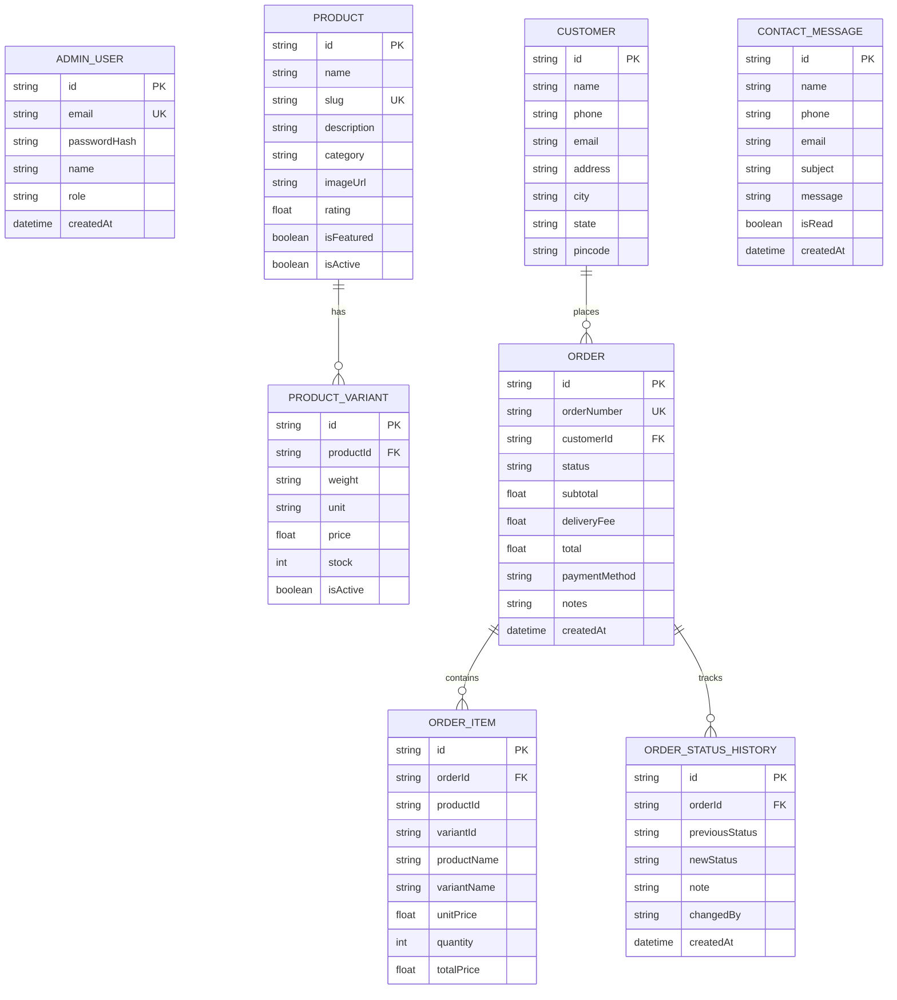

# 🌾 Annapurna Aahaar — 3D E-Commerce Platform

> **"Tradition in Every Grain."**
> *Pure Ingredients. Authentic Indian Taste.*


---

## 📖 Project Overview

**Annapurna Aahaar** is a production-grade full-stack 3D e-commerce web application built for an Indian food processing and traditional grain milling business. The platform bridges generational Indian culinary traditions with a luxury digital buying experience.

### Key Highlights:
- **Interactive 3D Hero Scene**: Custom 3D Stone Mill (Chakki), grain hopper, and floating spice particles powered by Three.js and React Three Fiber with graceful 2D fallbacks.
- **Dynamic Product Catalogue & Variants**: Database-driven catalog featuring handcrafted Papads (Urad Dal, Moong Dal, Masala, Rice), sun-dried whole wheat Sevaya, pure golden Turmeric (Haldi), and instant Noodles with dynamic price calculations per weight (500g, 1kg, 2kg, etc.).
- **Server-Validated Ordering System**: Frontend never dictates final totals; the Express.js backend securely validates stock, fetches real-time DB prices, and computes subtotal and delivery charges.
- **Cash on Delivery (Pay on Delivery)**: Authentic Indian payment flow without fake mock payment gateways.
- **Live Order Tracking Timeline**: Real-time customer tracking step timeline (`PENDING` ➔ `ACCEPTED` ➔ `PROCESSING` ➔ `READY` ➔ `OUT FOR DELIVERY` ➔ `DELIVERED` or `REJECTED`).
- **Protected Admin Order Center**: JWT-authenticated admin dashboard with real-time pending notification badges, instant **ACCEPT ORDER** and **REJECT ORDER** actions, status progression, line-item inspector, and customer enquiry viewer.

---

## 🛠️ Technology Stack

| Layer | Technologies |
| :--- | :--- |
| **Frontend** | React 18, TypeScript, Vite, Tailwind CSS, Framer Motion, Three.js, `@react-three/fiber`, `@react-three/drei`, Lucide Icons |
| **Backend** | Node.js, Express.js, TypeScript, Zod validation, JWT, bcryptjs, CORS |
| **Database & ORM** | Prisma ORM with SQLite (local development) / PostgreSQL (production) |
| **Styling & Assets** | Custom Indian heritage palette (Turmeric Gold, Terracotta, Heritage Maroon, Warm Cream), typography (Playfair Display & Plus Jakarta Sans) |
| **Deployment** | Vercel (Frontend) + Render / Railway / Node server (Backend) + Neon / Supabase (PostgreSQL) |

---

## 🏛️ Architecture & Project Structure

```
annapurna-aahaar/
├── backend/
│   ├── prisma/
│   │   ├── schema.prisma            # Relational models (Products, Variants, Customers, Orders, Items, StatusHistory, Contacts, Admin)
│   │   └── seed.ts                  # Database seeder with complete catalog & admin
│   ├── src/
│   │   ├── config/                  # Environment & database client
│   │   ├── controllers/             # Product, Order, Admin, Contact controllers
│   │   ├── middleware/              # JWT auth, error handler, input validators
│   │   ├── routes/                  # Express REST routes (/api/products, /api/orders, /api/admin, /api/contact)
│   │   ├── types/                   # TypeScript interfaces
│   │   ├── test-e2e.ts              # Automated end-to-end testing script
│   │   └── server.ts                # Main Express server entrypoint
│   ├── package.json
│   └── tsconfig.json
│
├── frontend/
│   ├── public/                      # Static assets, sitemap.xml, robots.txt, favicon.svg
│   ├── src/
│   │   ├── components/
│   │   │   ├── 3d/                  # 3D Hero Canvas, Chakki Stone Mill mesh, floating grain particles
│   │   │   ├── common/              # Navbar, Footer, SEOHead
│   │   │   ├── product/             # 3D Product Card, dynamic variant selector
│   │   │   └── cart/                # Slide-over Cart Drawer, Free delivery progress bar
│   │   ├── context/                 # CartContext, AuthContext, ToastContext
│   │   ├── pages/                   # Home, Products, ProductDetail, Cart, Checkout, OrderSuccess, OrderTrack, OurStory, WhyUs, Contact, AdminLogin, AdminDashboard
│   │   ├── services/                # API client wrapper
│   │   ├── types/                   # Frontend TypeScript interfaces
│   │   ├── utils/                   # Currency formatters (₹ INR), date helpers, mobile/PIN validators
│   │   ├── App.tsx                  # React Router configuration
│   │   └── main.tsx                 # DOM Entrypoint
│   ├── index.html                   # SEO Meta, Schema.org JSON-LD, Google Fonts
│   ├── tailwind.config.js           # Heritage color theme & animations
│   ├── vite.config.ts               # Proxy configuration to backend API
│   └── package.json
│
├── .gitignore
├── .env.example
└── README.md
```

---

## 🗄️ Database Schema Overview



---

## 🚀 Getting Started Locally

### 1. Prerequisites
- **Node.js**: v18.0.0 or higher
- **npm** or **yarn** / **pnpm**

### 2. Clone the Repository
```bash
git clone https://github.com/your-username/annapurna-aahaar.git
cd annapurna-aahaar
```

### 3. Backend Setup
```bash
cd backend
npm install

# Initialize database and run migrations
npm run prisma:push

# Seed products and admin user
npm run prisma:seed

# Start backend development server (Port 5000)
npm run dev
```

### 4. Frontend Setup (in a new terminal)
```bash
cd frontend
npm install

# Start Vite development server (Port 5173)
npm run dev
```

Open **`http://localhost:5173`** in your browser.

---

## 🔐 Administrator Access

- **Admin Login URL**: `http://localhost:5173/admin/login`
- **Default Email**: `admin@annapurnaaahaar.in`
- **Default Password**: `Admin@Annapurna2026`

*(You can customize the initial admin credentials in `backend/.env` before running the seed script).*

---

## 🔄 Order Lifecycle & Workflow

1. **Customer Discovery**: Customer browses products, filters by category (e.g. Papad, Grains, Spices), and picks weight (e.g. 500g vs 1kg).
2. **Dynamic Cart**: Price dynamically updates on the fly with a real-time free delivery progress meter.
3. **Validated Checkout**: Form verifies standard 10-digit Indian mobile numbers and 6-digit PIN codes.
4. **Order Placement (`POST /api/orders`)**: Backend verifies price from database and generates an order number (e.g. `AA-20260823-4812`). Initial status is set to **`PENDING`**.
5. **Real-time Admin Review**: Admin dashboard immediately updates its pending badge count.
6. **Accept / Reject Workflow**:
   - Clicking **`ACCEPT ORDER`** transitions the status to **`ACCEPTED`** and logs timestamp and manager details in the audit trail.
   - Clicking **`REJECT ORDER`** opens a confirmation modal with optional reason and marks status as **`REJECTED`**.
7. **Fulfillment Progression**: Admin progresses the order through `PROCESSING` ➔ `READY` ➔ `OUT_FOR_DELIVERY` ➔ `DELIVERED`.
8. **Customer Tracking**: The live tracking page `/track/:orderNumber` updates automatically through real-time polling.

---

## 📡 REST API Documentation

### Public Endpoints
| Method | Route | Description |
| :--- | :--- | :--- |
| `GET` | `/api/health` | API Health Check |
| `GET` | `/api/business-info` | Get business contact details |
| `GET` | `/api/products` | List products with category/search filters |
| `GET` | `/api/products/categories` | List product categories with item counts |
| `GET` | `/api/products/:slug` | Get single product detail with related items |
| `POST` | `/api/orders` | Place a customer order (server-side price calculation) |
| `GET` | `/api/orders/:orderNumber` | Customer order tracking lookup |
| `POST` | `/api/contact` | Submit contact / bulk order enquiry |

### Protected Admin Endpoints (`Bearer <JWT>`)
| Method | Route | Description |
| :--- | :--- | :--- |
| `POST` | `/api/admin/login` | Authenticate admin and receive JWT token |
| `GET` | `/api/admin/stats` | Dashboard metrics (revenue, pending, delivered) |
| `GET` | `/api/admin/orders` | List orders with status filters and search |
| `GET` | `/api/admin/orders/:id` | Get full order details & audit history |
| `PATCH` | `/api/admin/orders/:id/status` | Update order status (`ACCEPTED`, `REJECTED`, etc.) |
| `GET` | `/api/admin/contact-messages` | View customer enquiries |
| `PATCH` | `/api/admin/contact-messages/:id/read` | Mark enquiry as read |

---

## 🧪 Automated Testing

Execute the end-to-end integration test runner:
```bash
cd backend
npm run test:e2e
```
This tests:
- Database connection & product variant consistency
- Customer creation & server-side price calculation
- Order tracking query
- Admin authentication & JWT token generation
- Order ACCEPTANCE transition & audit log verification
- Order REJECTION transition
- Contact form enquiry persistence

---

## 🌐 Production Deployment Guide

### Deploying Frontend to Vercel
1. Push the repository to GitHub.
2. Link the repository to **Vercel**.
3. Set **Root Directory** to `frontend`.
4. Set Environment Variable: `VITE_API_URL = https://your-backend-api.onrender.com/api`.
5. Deploy.

### Deploying Backend to Render / Railway
1. Create a new Web Service on **Render** or **Railway**.
2. Set **Root Directory** to `backend`.
3. Set Build Command: `npm install && npm run prisma:push && npm run prisma:seed && npm run build`.
4. Set Start Command: `npm start`.
5. Set Environment Variables:
   - `DATABASE_URL`: Your PostgreSQL connection string (Neon / Supabase).
   - `JWT_SECRET`: Random secure string.
   - `NODE_ENV`: `production`.
   - `CLIENT_URL`: Your Vercel frontend URL.

---

## 📜 License

Distributed under the MIT License. Crafted with devotion for **Annapurna Aahaar**.
