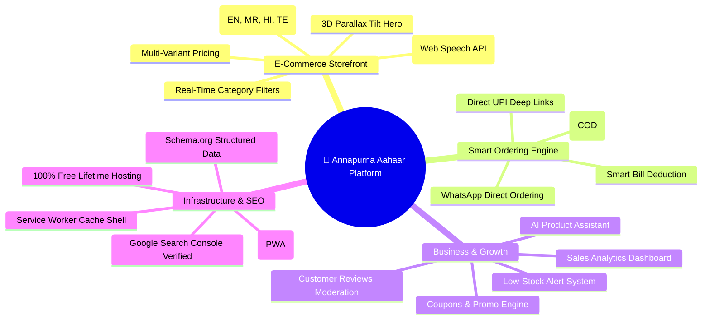
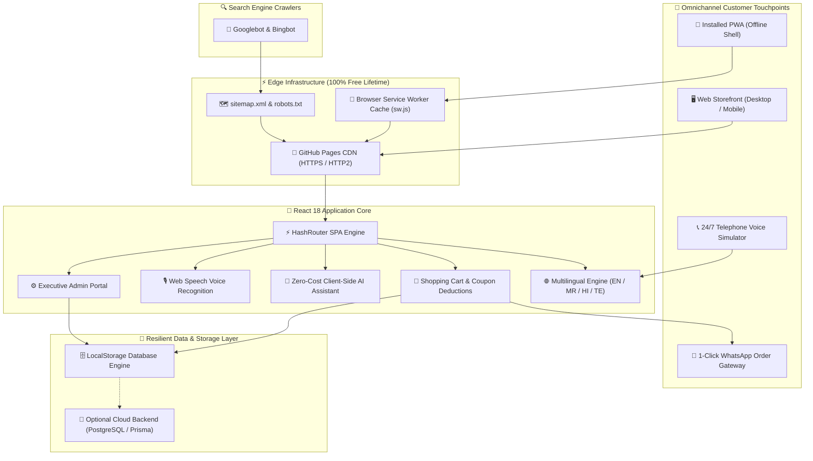

# 🌾 ANNAPURNA AAHAAR (अन्नपूर्णा आहार • అన్నపూర్ణ ఆహార్)
### *Tradition in Every Grain.*
**Enterprise-Grade Handcrafted Indian Heritage Foods E-Commerce, PWA & Omnichannel Ordering Platform**

---

[](https://bandegangasai.github.io/annapurna-aahaar/)
[](https://bandegangasai.github.io/annapurna-aahaar/)
[](#-multilingual-internationalization-4-languages)
[](https://bandegangasai.github.io/annapurna-aahaar/)
[](https://bandegangasai.github.io/annapurna-aahaar/)
[](LICENSE)

---

## 🌟 Official Production Access & Direct Portals

> ### 🚀 **Live E-Commerce Web Application:**
> ### 👉 **[https://bandegangasai.github.io/annapurna-aahaar/](https://bandegangasai.github.io/annapurna-aahaar/)** 👈

| Gateway / Portal | Direct Production Link | Functional Scope |
| :--- | :--- | :--- |
| 🛍️ **Interactive Storefront** | [Visit Storefront](https://bandegangasai.github.io/annapurna-aahaar/) | Browse products, weight variants, interactive cart, coupon discounts |
| 📦 **Real-Time Order Tracker** | [Live Order Tracker](https://bandegangasai.github.io/annapurna-aahaar/#/track) | Live 5-stage order status tracking from kitchen to customer doorstep |
| 🤖 **AI Smart Assistant** | Built-in Interactive Chat Widget | Natural language product recommendations, recipe pairing & WhatsApp ordering |
| 🎙️ **Voice Search** | Integrated on Catalog & Navbar | Web Speech API speech-to-text voice search across all regional dialects |
| 📖 **Heritage Story & Origin** | [Our Story (Bhainsa Kitchens)](https://bandegangasai.github.io/annapurna-aahaar/#/our-story) | Brand origin, sun-curing heritage, and stone-ground quality standards |
| ⚙️ **Store Admin Dashboard** | [Admin Portal](https://bandegangasai.github.io/annapurna-aahaar/#/admin/login) | Real-time order management, inventory control, coupon engine, analytics |
| 🗺️ **XML Sitemap** | [sitemap.xml](https://bandegangasai.github.io/annapurna-aahaar/sitemap.xml) | Automated search engine crawl map for Google Search Console & Bing |
| 🤖 **Robots Directives** | [robots.txt](https://bandegangasai.github.io/annapurna-aahaar/robots.txt) | Search engine indexing directives and privacy protection rules |
| 📱 **PWA Manifest** | [manifest.json](https://bandegangasai.github.io/annapurna-aahaar/manifest.json) | Standalone installable mobile & desktop web application config |

---

## 🏛️ Brand & Business Profile

* **Brand Name**: **ANNAPURNA AAHAAR**
* **Tagline**: *"Tradition in Every Grain."*
* **Production Workshop**: **Main Market Area, Bhainsa, Nirmal District, Telangana — 504103, India**
* **Core Philosophy**: 100% Pure, sun-cured, stone-ground authentic Indian food staples crafted with traditional heritage methods and zero artificial chemicals.
* **Customer Channels**: Multilingual Web Storefront, Progressive Web App (PWA), 1-Click WhatsApp Direct Ordering, and 24/7 Voice Hotline Simulator.
* **Official Business Inquiries**: `annapurnaaahaar@gmail.com`

---

## 🍛 Authentic Handcrafted Product Portfolio

All authentic Annapurna Aahaar products are prepared in small batches using traditional recipes in Bhainsa, Telangana, naturally sun-cured, and packaged hygienically:

| # | Product Name | Description & Taste Profile | Packaging Options | Base Price (INR) |
| :-: | :--- | :--- | :-: | :-: |
| 1 | **Traditional Wheat Sevaya** | Handcrafted whole-wheat roasted vermicelli sevaya | 250g, 500g, 1kg | From ₹90 |
| 2 | **Urad Dal Papad** | Crispy black-gram urad dal papad with black pepper & cumin | 250g, 500g, 1kg | From ₹150 |
| 3 | **Moong Dal Papad** | Light, easily digestible yellow moong dal papad | 250g, 500g, 1kg | From ₹160 |
| 4 | **Masala Papad** | Spicy Indian papad bursting with red chili, ajwain & cumin | 250g, 500g, 1kg | From ₹150 |
| 5 | **Rice Papad** | Steamed & sun-dried rice flour papad with delicate crisp | 250g, 500g, 1kg | From ₹150 |
| 6 | **Pure Turmeric (Haldi) Powder** | 100% stone-ground golden turmeric with high natural curcumin | 100g, 250g, 500g, 1kg | From ₹80 |
| 7 | **Maggie** | Classic Indian-spiced instant noodle packs | 4-Pack, 8-Pack | From ₹85 |
| 8 | **Noodles** | High-protein wheat noodles for Indian-style Hakka cooking | 300g, 500g, 1kg | From ₹95 |

---

## 🚀 Advanced Platform Features & Capabilities



### 1. 💬 WhatsApp Direct Ordering & Instant Checkout
* **1-Click WhatsApp Ordering**: Customers can place orders directly on WhatsApp with a single tap from either individual Product Detail pages or the Cart Drawer.
* **Auto-Formatted Itemized Invoices**: Automatically generates a structured, pre-filled WhatsApp message containing:
  - Customer Full Name & Delivery Address
  - Line-by-line item details, selected weight variants, and quantities
  - Applied coupon codes and discount calculations
  - Flat shipping calculation (₹40 standard, **FREE above ₹500**)
  - Grand total and preferred payment choice (COD / UPI).

### 2. 🤖 Zero-Cost AI Smart Product Assistant
* **Annapurna Assistant**: An intelligent, client-side conversational assistant widget accessible 24/7 across the storefront.
* **Smart Intent Recognition**: Detects customer questions about spices, papads, fasting foods, pricing under budget limits, shipping policies, and cooking suggestions.
* **Interactive Product Action Cards**: Returns clickable product cards inside the chat window with direct *"View Details"* and *"Add to Cart"* buttons.

### 3. 🎙️ Voice-Activated Product Search
* **Web Speech API Integration**: Integrated browser speech recognition on both the Navbar search bar and the Catalog page.
* **Speech-to-Text Query Resolution**: Enables customers to speak product names in regional accents for instant catalog filtering.

### 4. 🏷️ Dynamic Offers & Coupons Engine
* Built-in discount coupon engine supporting both percentage (`%`) and fixed (`₹`) deductions.
* Includes real-time validation for minimum order amounts and maximum discount caps.
* **Default Active Codes**:
  - `WELCOME10` — 10% OFF on all handcrafted food orders (Min order ₹200).
  - `AAHAAR50` — Flat ₹50 OFF on heritage pantry orders (Min order ₹500).
  - `FESTIVE15` — 15% OFF for festive seasonal orders (Min order ₹600).
* **Admin Management**: Full CRUD interface inside the Admin Portal to create, activate, deactivate, or delete promotional codes.

### 5. 📦 Real-Time Inventory & Low-Stock Alerts
* Variant-level stock quantity tracking.
* **Automated Low-Stock Warning Banner**: Prominently alerts the store administrator when any product variant inventory falls to $\le 10$ units.
* Single-click stock replenishment and price updating modal.

### 6. ⭐ Customer Reviews & Trust Moderation
* Public review submission form on product detail pages with 5-star rating selector, reviewer name, city, and verified feedback.
* **Admin Moderation Queue**: Store owners can review, approve, reject, or remove customer reviews before publishing.
* Dynamically recalculates product rating averages and star counts.

### 7. 📱 Progressive Web App (PWA) & Offline Shell
* [`sw.js`](frontend/public/sw.js) Service Worker caching static assets, stylesheets, scripts, and product imagery.
* Full [`manifest.json`](frontend/public/manifest.json) configuration allowing customers to install the website as a standalone application on Android, iOS, Windows, and macOS.

### 8. 🌐 Complete Multilingual Internationalization
* Instant regional language switcher supporting **English**, **Marathi (मराठी)**, **Hindi (हिन्दी)**, and **Telugu (తెలుగు)**.
* Complete localization covering navigation, hero messaging, product specifications, weight labels, cart calculations, order receipts, and return policies.
* Persistent language preference saved in `localStorage`.

### 9. 🔍 Enterprise Technical SEO & Structured Data
* **Google Search Console Integration**: Fully verified ownership and automated search indexing.
* **Schema.org JSON-LD Models**:
  - `WebSite` with internal SearchAction
  - `LocalBusiness` & `OnlineStore` with opening hours, geo-coordinates, and contact endpoints
  - `Product` & `Offer` schemas for all 8 authentic items with pricing and in-stock availability
  - `BreadcrumbList` navigation hierarchy.
* **Dynamic Open Graph & Twitter Cards**: High-resolution 1200x900 social preview cards for WhatsApp, Facebook, Twitter, and LinkedIn sharing.

---

## 🏗️ Platform System Architecture



---

## 🛠️ Technology Stack

| Layer | Technologies & Libraries |
| :--- | :--- |
| **Frontend Framework** | React 18.2, TypeScript 5.2, Vite 6 |
| **Styling & Design System** | Tailwind CSS 3.4, Custom Heritage Palette (`#173F35`, `#C79A45`, `#A65332`, `#FAF6EE`) |
| **Icons & Visuals** | Lucide React, Custom Optimized WebP culinary assets |
| **State & Business Logic** | React Context API (`CartContext`, `LanguageContext`, `AuthContext`, `ToastContext`) |
| **Voice & Speech** | Web Speech Recognition API (`SpeechRecognition` / `webkitSpeechRecognition`), Web Audio API Chimes |
| **PWA & Offline** | Service Worker (`sw.js`), Web App Manifest (`manifest.json`) |
| **Backend (Optional)** | Node.js, Express, TypeScript, Prisma ORM, PostgreSQL |
| **Hosting & CI/CD** | GitHub Pages, GitHub Actions (`deploy.yml`), Zero-Cost Lifetime Infrastructure |

---

## ⚡ Local Development & Contribution

### 1. Prerequisites
- **Node.js**: v18.0 or higher
- **npm**: v9.0 or higher
- **Git**

### 2. Clone & Install Dependencies
```bash
# Clone the repository
git clone https://github.com/bandegangasai/annapurna-aahaar.git
cd annapurna-aahaar

# Install frontend dependencies
cd frontend
npm install
```

### 3. Start Frontend Local Development Server
```bash
npm run dev
```
The application will be live locally at `http://localhost:5173/`.

### 4. Build for Production
```bash
npm run build
```
This runs TypeScript compilation (`tsc`) and Vite bundling (`vite build`) producing the optimized distribution in `frontend/dist/`.

---

## 📄 License & Brand Ownership

© 2026 **ANNAPURNA AAHAAR**. All rights reserved.  
Authentic Heritage Food Products handcrafted in **Bhainsa, Nirmal District, Telangana — 504103, India**.
