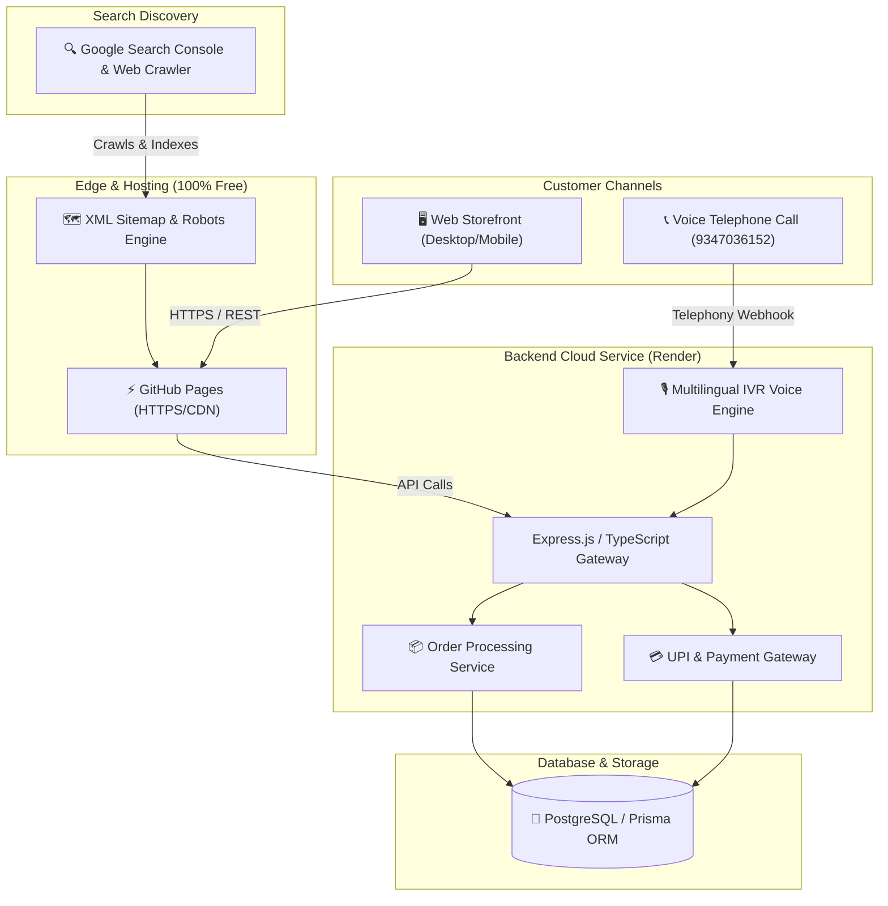

# 🌾 ANNAPURNA AAHAAR (अन्नपूर्णा आहार • అన్నపూర్ణ ఆహార్)
### *Tradition in Every Grain.*
**Handcrafted Indian Heritage Food Products & Multilingual Voice Telephony E-Commerce Platform**

---

[](https://bandegangasai.github.io/annapurna-aahaar/)
[](#-multilingual-internationalization-4-languages)
[](tel:9347036152)
[](https://bandegangasai.github.io/annapurna-aahaar/)
[](LICENSE)

---

## 🌟 OFFICIAL PRODUCTION ACCESS

> ### 🚀 **Live E-Commerce Web Application:**
> ### 👉 **[https://bandegangasai.github.io/annapurna-aahaar/](https://bandegangasai.github.io/annapurna-aahaar/)** 👈

| Gateway | Link / Endpoint | Purpose |
| :--- | :--- | :--- |
| 🛍️ **Interactive Web Storefront** | [https://bandegangasai.github.io/annapurna-aahaar/](https://bandegangasai.github.io/annapurna-aahaar/) | Browse products, select weights, add to cart & checkout |
| 📦 **Real-Time Order Tracking** | [https://bandegangasai.github.io/annapurna-aahaar/#/track](https://bandegangasai.github.io/annapurna-aahaar/#/track) | Live order status tracking from kitchen to doorstep |
| 📞 **24/7 Voice Telephony Hotline** | `tel:9347036152` | Multilingual automated telephone ordering & assistance |
| 🗺️ **XML Sitemap** | [sitemap.xml](https://bandegangasai.github.io/annapurna-aahaar/sitemap.xml) | Automated search engine crawl map for Google & Bing |
| 🤖 **Robots Directives** | [robots.txt](https://bandegangasai.github.io/annapurna-aahaar/robots.txt) | Search engine indexing rules & security filters |
| 🐙 **Source Code Repository** | [GitHub Repo](https://github.com/bandegangasai/annapurna-aahaar) | Official repository with CI/CD deployment pipelines |

---

## 🏛️ Brand & Business Profile

* **Business Name**: **ANNAPURNA AAHAAR**
* **Tagline**: *"Tradition in Every Grain."*
* **Founder & Owner**: **Bande Omkar**
* **Culinary Heritage Location**: **Bhainsa, Nirmal District, Telangana — 504103, India**
* **Primary IVR / Voice Customer Helpline**: **`9347036152`**
* **Payment Mobile & Support**: **`9542836358`**
* **Official UPI ID**: **`9542836358@ybl`** *(India Post Payment Bank - 3676)*
* **Official Business Email**: **`annapurnaaahaar@gmail.com`**

---

## 🍛 Handcrafted Heritage Product Catalog

All authentic products are prepared using time-honored traditional techniques in Bhainsa, Telangana, sun-cured, and hygienically packed with zero chemical additives:

| # | Product Name | Description | Available Packaging | Price (INR) |
| :-: | :--- | :--- | :-: | :-: |
| 1 | **Traditional Wheat Sevaya** | Handcrafted whole-wheat roasted vermicelli sevaya | 250g, 500g, 1kg | Starting at ₹90 |
| 2 | **Urad Dal Papad** | Crispy black-gram urad dal papad with black pepper & cumin | 250g, 500g, 1kg | Starting at ₹150 |
| 3 | **Moong Dal Papad** | Light, easily digestible yellow moong dal papad | 250g, 500g, 1kg | Starting at ₹160 |
| 4 | **Masala Papad** | Spicy Indian papad bursting with red chili, ajwain & cumin | 250g, 500g, 1kg | Starting at ₹150 |
| 5 | **Rice Papad** | Steamed & sun-dried rice flour papad with delicate crisp | 250g, 500g, 1kg | Starting at ₹150 |
| 6 | **Pure Turmeric Powder** | 100% stone-ground golden haldi powder with high curcumin | 100g, 250g, 500g, 1kg | Starting at ₹80 |
| 7 | **Maggie** | Classic Indian-spiced instant noodle packs | 4-Pack, 8-Pack | Starting at ₹85 |
| 8 | **Noodles** | High-protein wheat noodles for Indian-style Hakka cooking | 300g, 500g, 1kg | Starting at ₹95 |

---

## 💎 Core Platform Capabilities

### 1. 🎨 Premium Indian Heritage Visual Identity (60-30-10 Rule)
* **Forest Green (`#173F35`)** — Primary brand identity and structural elegance.
* **Warm Ivory (`#F8F3E7`)** — Authentic parchment background canvas.
* **Antique Gold (`#C79A45`)** — Premium borders, medals, accents, and action buttons.
* **Terracotta (`#A65332`)** — Indian clay & earth contrast tones.
* **Typography**: *Playfair Display* (Editorial headings), *Inter* (UI/Body), *Noto Sans Devanagari* (Hindi/Marathi), and *Noto Sans Telugu* (Telugu).

### 2. ✨ 3D Interactive Heritage Hero Experience
* Smooth 3D perspective physics with real-time mouse tracking and parallax tilt (`rotateX`, `rotateY`, `scale3d`).
* High-definition culinary photography showcasing crispy papads in an engraved brass thali, pure golden turmeric, whole wheat vermicelli, raw grains, and aromatic Indian spices.

### 3. 🌐 Full Multilingual Internationalization (4 Languages)
* Instant 1-click regional switcher across the platform: **`[ 🌐 English ] [ मराठी ] [ हिन्दी ] [ తెలుగు ]`**.
* Complete end-to-end localization covering product cards, weight selections, cart calculations, checkout receipts, live tracking, and support channels.
* Preference saved in `localStorage` for returning visitors.

### 4. 📞 Multilingual Voice Telephony & IVR Engine
* 24/7 automated telephone voice helpline at **`9347036152`** supporting English, Marathi, Hindi, and Telugu.
* Automated keypad ordering, live order status lookup, order cancellation, and kitchen staff dispatch.
* Robust session recovery backed by PostgreSQL state storage and Polly neural voices (*Aditi*, *Chitra*, *Kajal*).

### 5. 💳 Multi-Mode Payment Infrastructure
* **Cash on Delivery (COD)**: Doorstep settlement upon delivery.
* **Direct UPI Transfer**: 1-click UPI copy, mobile deep link support (`upi://pay`), and 12-digit transaction reference verification.
* **Online Payment Gateway**: Secure digital checkout with cards, net banking, and UPI.

### 6. 🔍 100% Free Google Search Engine Optimization (SEO)
* **Google Verification**: Verified and active via Google Search Console.
* **Schema.org Structured Data**: Integrated `WebSite`, `LocalBusiness`, `Organization`, and `Product`/`Offer` JSON-LD schemas.
* **Pre-Rendered Fallback**: Semantic initial HTML container for non-JS web crawlers.
* **Sitemap & Robots**: Structured `sitemap.xml` and privacy-tuned `robots.txt`.

---

## 🏗️ System Architecture



---

## 🛠️ Technology Stack

| Layer | Technologies & Frameworks |
| :--- | :--- |
| **Frontend Framework** | React 18, TypeScript, Vite 6, Tailwind CSS 3 |
| **Animation & 3D** | Framer Motion 3D Parallax Physics, Lucide React Icons |
| **Backend Framework** | Node.js, Express, TypeScript, Zod Schema Validation |
| **Database & ORM** | PostgreSQL, Prisma ORM 5 |
| **Voice & Telephony** | TwiML XML Response Generator, AWS Polly Multilingual TTS |
| **Testing Suite** | Automated E-Commerce E2E Suite, Automated IVR State Machine Suite |
| **Hosting & CI/CD** | GitHub Pages (Frontend), Cloud Backend (Render), Git Version Control |

---

## ⚡ Local Development & Testing

### 1. Backend Setup
```bash
cd backend
npm install

# Copy environment variables
cp .env.example .env

# Generate Prisma client & apply database migrations
npm run prisma:generate
npm run prisma:push

# Seed authentic product catalog
npm run prisma:seed

# Start backend server
npm run dev
```

### 2. Frontend Setup
```bash
cd frontend
npm install

# Start Vite development server
npm run dev
```

### 3. Run Automated Tests
```bash
# Run End-to-End E-Commerce Test Battery
cd backend
npm run test:e2e

# Run Multilingual IVR Telephony Test Battery
npm run test:ivr:e2e
```

---

## 📄 License & Ownership

© 2026 **ANNAPURNA AAHAAR**. All rights reserved.  
Founded & Managed by **Bande Omkar** — **Bhainsa, Nirmal District, Telangana (504103)**.
